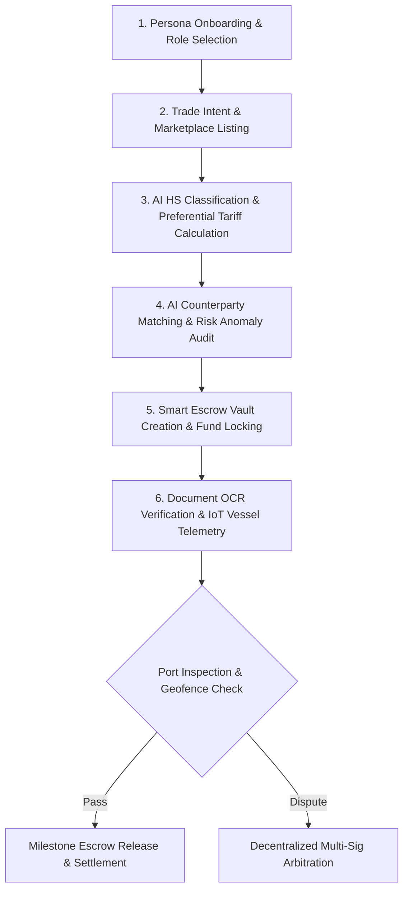

# GLOBEX — Global B2B Cross-Border Trade & Intelligence Platform

<div align="center">


**Enterprise-Grade B2B Cross-Border Trade Matching, Smart Escrow Vaults & Regulatory Compliance Engine**

[Quick Start & How to Run](#-quick-start--how-to-run) • [Application Flow](#-end-to-end-application-flow) • [Architecture](#-system-architecture) • [API Reference](#-backend-api-microservices) • [Documentation Hub](./docs/README.md)

</div>

---

## 🌍 Overview

**GLOBEX** is an institutional cross-border B2B trade execution and trust operating system connecting verified exporters and global buyers. Built to eliminate cross-border trade friction, prevent payment fraud, automate regulatory compliance, and provide real-time maritime intelligence, GLOBEX combines:

1. **Interactive 3D Maritime Earth (`TradeGlobe`)**: WebGL cartographic visualization rendering global trade hubs, port coordinates, live shipping arcs, and camera physics.
2. **AI Semantic Matching & Duty Engine**: Automatic buyer-seller matching using product specifications, FOB pricing, APEDA/ISO/Halal certifications, and preferential trade agreements (e.g., India-UAE CEPA 0% tariff savings).
3. **ML Anomaly & Risk Detection**: PyTorch GRU Autoencoder + XGBoost models for anomaly detection, price volatility analysis, and sanctions auditing (OpenSanctions API).
4. **Programmable USDC Smart Escrow Vaults**: Conditional multi-sig smart contract vaults that lock funds and release milestones upon port sign-offs and IoT geofence arrival.
5. **Automated OCR Document Cross-Verification**: Instant cross-reconciliation of Commercial Invoices, Clean On-Board Bills of Lading, and Phytosanitary certificates with cryptographic tamper-evident SHA-256 proofs.
6. **Real-Time IoT Vessel Telemetry**: Live AIS marine tracking and choke-point route risk monitoring (e.g., Red Sea / Bab-el-Mandeb transit alerts).
7. **Decentralized Dispute Resolution**: Multi-sig evidence-backed arbitration with split-fund escrow release.

---

## 🔄 End-to-End Application Flow

The lifecycle of a cross-border trade transaction on GLOBEX follows a 7-stage automated execution pipeline:



### Stage-by-Stage Breakdown

1. **User Onboarding & Persona Selection (`/onboarding`, `/role-select`)**
   - Users choose their operational role: **Exporter**, **Global Buyer/Importer**, **Compliance Officer**, or **Escrow Arbitrator**.
   - Verified credentials and KYC/KYB records are initialized.

2. **Trade Intent & Marketplace Creation (`/trade-intent`, `/create-listing`, `/marketplace`)**
   - Exporters create product listings with FOB prices, shipping origin/destination, and food safety/quality certifications.
   - Buyers submit buying intent wizards detailing target volume, target unit price, and required delivery window.

3. **AI HS Classification & Tariff Analysis (`POST /predict/hs-code`, `POST /compliance/rag-analyze`)**
   - The AI classifier analyzes raw product text to determine the 6-digit Harmonized System (HS) code (e.g., `1006.30` for Basmati Rice).
   - Calculates import tariffs and highlights duty-saving Free Trade Agreements (e.g., CEPA 0% preferential tariffs).

4. **AI Counterparty Matching & Anomaly Detection (`POST /predict/counterparty-match`, `POST /api/trade-anomaly/predict`)**
   - Ranks top matching buyers/suppliers based on trade history, capacity, and pricing.
   - The PyTorch GRU Autoencoder & XGBoost anomaly service scans transactions for price manipulation, quantity anomalies, and sanctions flags via OpenSanctions.

5. **Programmable Escrow Vault Initialization (`/escrow`, `/trades/:id`)**
   - A multi-sig USDC smart contract vault is deployed for the transaction.
   - Buyer locks trade capital into escrow; funds are held securely until contractual milestones are satisfied.

6. **OCR Document Verification & Vessel Tracking (`/documents`, `/shipments`)**
   - AI OCR extracts structured metadata from Commercial Invoices, Bills of Lading, and Phytosanitary certificates.
   - SHA-256 cryptographic hashes cross-verify documents against fraud.
   - Live AIS vessel telemetry tracks ship movement, monitoring choke-point risks along maritime routes.

7. **Settlement or Dispute Arbitration (`/blockchain`, `/disputes`)**
   - Upon successful port inspection and IoT geofence verification, escrow funds are automatically released to the exporter.
   - If discrepancies arise, the transaction moves to human-in-the-loop multi-sig arbitration with evidence submission.

---

## 🏗️ System Architecture

GLOBEX is built on a modern decoupled architecture comprising a high-performance React frontend, a unified FastAPI AI/ML microservice gateway, and an n8n workflow engine:

```
+-----------------------------------------------------------------------+
|                           GLOBEX FRONTEND                             |
|          React 18 + TypeScript + Vite + Tailwind CSS + WebGL          |
|    (Marketplace, Trade Workspace, 3D Globe, Escrow, OCR Studio)       |
+-----------------------------------------------------------------------+
        |                                       |
        | HTTP REST                             | Webhook Events
        v                                       v
+-------------------------------+       +-------------------------------+
|     FASTAPI ML GATEWAY        |       |     N8N AUTOMATION ENGINE     |
|      (Python / main.py)       |       |   (Workflow Automation Engine)|
|  - HS Classifier              |       +-------------------------------+
|  - PyTorch GRU Anomaly        |                       |
|  - XGBoost Risk Model         |                       v
|  - Partner Discovery          |       +-------------------------------+
|  - Document OCR Extraction    |       |      SUPABASE / POSTGRES      |
|  - OpenSanctions API          |       |   (Trade Records & Audit)     |
+-------------------------------+       +-------------------------------+
```

---

## ⚙️ Prerequisites & Environment Setup

### Prerequisites

Make sure you have the following installed on your machine:
- **Node.js** >= `18.0.0` (LTS recommended)
- **npm** >= `9.0.0` (or `pnpm` / `yarn`)
- **Python** >= `3.10`
- **Git**

### Environment Configuration (`.env`)

Create a `.env` file in the root directory (or copy from `.env.local.example`):

```bash
cp .env.local.example .env
```

Key environment variables:

```env
# FastAPI Backend Configuration
VITE_FASTAPI_AI_URL=http://localhost:8000
PORT=8000
FRONTEND_URL=http://localhost:5173

# n8n Automation Webhook
VITE_N8N_WEBHOOK_URL=http://localhost:5678/webhook

# External Intelligence & Sanctions
OPENSANCTIONS_API_KEY=your_opensanctions_api_key

# Supabase Database (Optional - falls back to seed data if omitted)
SUPABASE_URL=https://your-project.supabase.co
SUPABASE_ANON_KEY=your_supabase_anon_key
VITE_SUPABASE_URL=https://your-project.supabase.co
VITE_SUPABASE_ANON_KEY=your_supabase_anon_key
```

---

## 🚀 Quick Start & How to Run

To run the complete GLOBEX platform, you will start both the **FastAPI Python AI Backend** and the **Vite React Frontend**.

### Step 1: Set Up & Run the Python AI Backend

Open a terminal in the project root directory:

```bash
# 1. Create a Python virtual environment
python -m venv .venv

# 2. Activate the virtual environment
# On Windows (PowerShell):
.venv\Scripts\Activate.ps1
# On Windows (CMD):
.venv\Scripts\activate.bat
# On macOS/Linux:
source .venv/bin/activate

# 3. Install Python dependencies
pip install -r requirements.txt

# 4. Start the FastAPI Unified API Gateway
python main.py
```

The FastAPI backend will start on **`http://localhost:8000`**.
- Interactive OpenAPI / Swagger Documentation: **`http://localhost:8000/docs`**
- System Health Check: **`http://localhost:8000/health`**

---

### Step 2: Set Up & Run the React Frontend

Open a **second terminal** window in the project root directory:

```bash
# 1. Install Node.js dependencies
npm install

# 2. Start the Vite local development server
npm run dev
```

The React frontend will launch at **`http://localhost:5173`** (or `http://localhost:8080`).

---

### Step 3: (Optional) Production Build & SPA Preview

If you want to test the production bundle:

```bash
# Build the production assets into dist/
npm run build

# Option A: Preview via Vite
npm run preview

# Option B: Preview via built-in Python SPA server
python spa_server.py
```

---

## 🔌 Backend API Microservices

The unified FastAPI server (`main.py`) exposes production microservice endpoints:

| Endpoint | Method | Description | Subsystem |
| :--- | :---: | :--- | :--- |
| `GET /` | `GET` | API Gateway Root metadata & operational status | Gateway |
| `GET /health` | `GET` | Aggregated health status of PyTorch/XGBoost models & DB | Health |
| `POST /predict/hs-code` | `POST` | Predicts 6-digit HS codes & import duty specs | HS Classifier |
| `POST /api/trade-anomaly/predict` | `POST` | Scans trades using PyTorch GRU & XGBoost for price/volume anomalies | Anomaly Engine |
| `POST /predict/market-opportunity` | `POST` | Ranks global export destination markets based on UN Comtrade data | Partner Discovery |
| `POST /predict/counterparty-match` | `POST` | Computes buyer-supplier compatibility match matrix | Counterparty Matcher |
| `POST /predict/counterparty-risk` | `POST` | Evaluates buyer/supplier trust score & sanctions compliance | Risk Engine |
| `POST /compliance/rag-analyze` | `POST` | Analyzes trade compliance & Free Trade Agreement (CEPA) savings | Compliance RAG |
| `POST /documents/ocr-extract` | `POST` | Extracts key fields from Invoices/Bills of Lading & generates SHA-256 proof | Document OCR |

Access **`http://localhost:8000/docs`** for interactive requests, schemas, and live testing.

---

## 🛠️ npm & Development Scripts

| Script | Purpose |
| :--- | :--- |
| `npm run dev` | Launches Vite dev server with hot module replacement (HMR) |
| `npm run build` | Runs TypeScript compilation & generates production bundle in `dist/` |
| `npm run preview` | Previews the compiled production bundle locally |
| `npm test` | Runs the Vitest test suite for components, state, and workflows |
| `npm run lint` | Runs ESLint analysis across TypeScript and React code |

---

## 📂 Repository Structure

```
globex_match/
├── main.py                                # Unified FastAPI Microservice Gateway
├── spa_server.py                          # Production Single Page Application server
├── requirements.txt                       # Python dependencies (FastAPI, PyTorch, XGBoost, etc.)
├── package.json                           # Node.js dependencies and script definitions
├── .env.local.example                     # Environment configuration template
├── README.md                              # Master Repository README
│
├── src/                                   # React 18 Frontend Application
│   ├── App.tsx                            # Router & Provider configuration
│   ├── components/                        # UI Components by domain
│   │   ├── ai/                            # AI Match explanations & assistants
│   │   ├── blockchain/                    # On-chain trade ledger tables
│   │   ├── documents/                     # Document Verification Studio & OCR
│   │   ├── escrow/                        # Smart Escrow cards & milestone release
│   │   ├── layout/                        # Navigation, Header, Persona Switcher
│   │   ├── marketplace/                   # Listing cards & partner catalogs
│   │   ├── shipments/                     # AIS Vessel tracking & telemetry
│   │   ├── trust/                         # Trust score gauges & breakdown drawers
│   │   ├── ui/                            # shadcn UI primitives
│   │   └── TradeGlobe.tsx                 # 3D WebGL Globe cartography component
│   ├── pages/                             # 22 View Pages (Dashboard, Marketplace, Trade Workspace, etc.)
│   ├── services/                          # API Service Clients (FastAPI, n8n, Supabase, OCR)
│   └── types/                             # Domain TypeScript interfaces
│
├── backend/                               # Machine Learning & Intelligence Assets
│   └── brain/                             # Trained models & datasets
│       ├── models/                        # Pre-trained ML artifacts
│       │   ├── trade_anomaly/             # XGBoost anomaly model & preprocessors
│       │   └── trade_risk/                # PyTorch GRU Autoencoder (`gru_autoencoder.pt`)
│       ├── processed/                     # Parquet feature tables
│       └── notebooks/                     # Jupyter EDA & model training notebooks
│
├── n8n/                                   # n8n Automation Workflows
│   ├── globex_master_automation.workflow.json # Master automation workflow export
│   └── globex_trade_automation.workflow.json # Trade automation reference workflow
│
├── scripts/                               # Python test & diagnostic scripts
│   ├── test_hs_and_demand.py             # HS classification & demand unit test
│   ├── test_proper_ranking.py            # Partner ranking verification script
│   └── test_supabase_connection.py      # Database connection tester
│
└── docs/                                  # Central Documentation Hub
    ├── README.md                          # Documentation index
    ├── PROJECT_OVERVIEW.md                # System mission & hackathon scope
    ├── TECH_STACK.md                      # Detailed technical specs
    ├── architecture/                      # Architectural specifications
    └── design/                            # UI/UX design standards & user flows
```

---

## 🧪 Testing & Quality Assurance

### Frontend Testing (Vitest)

```bash
npm test
```

Runs component tests, UI state assertions, and mock integration pipelines.

### Backend Testing (Python / Pytest)

With the virtual environment active:

```bash
# Run pytest unit tests
pytest

# Test HS classification and market demand calculations
python scripts/test_hs_and_demand.py

# Test destination ranking algorithms
python scripts/test_proper_ranking.py
```

---

## 🌐 Live Repository

- **GitHub Repository**: [https://github.com/chaurasia-aryan/GlobeX.git](https://github.com/chaurasia-aryan/GlobeX.git)

---

## 📜 License

Private & Confidential. All rights reserved.
