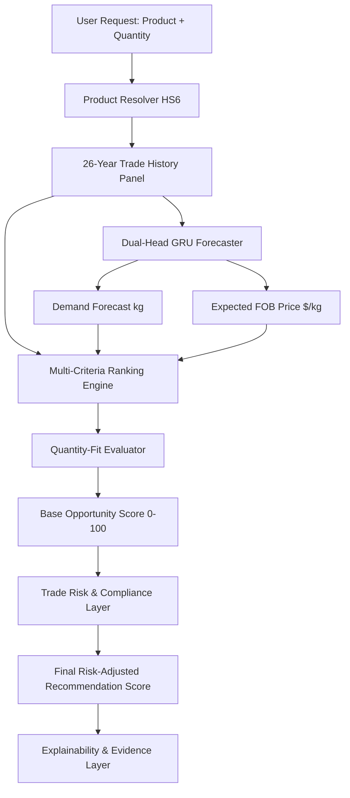

# Model Card: India Export Partner Opportunity & Forecasting Engine (Module 3)

## Model Details
- **Model Name**: Dual-Head GRU & Multi-Criteria Opportunity Ranker
- **Version**: 1.0.0
- **Developers**: SIH Trade Intelligence & GLOBEX Platform Team
- **Date**: August 2026
- **License**: Proprietary / SIH Competition
- **Intended Use**: Recommending and ranking global destination countries for Indian SME and enterprise exporters across 33 key agricultural, industrial, chemical, and technology product categories.

---

## Model Architecture & Components

### Multi-Criteria Opportunity Dimensions (Sum = 100%)
1. **Revealed Trade Demand (25%)**: 3-year historical export value/volume absorption.
2. **Forecast Demand Momentum (15%)**: Out-of-sample forward demand projection.
3. **Growth Momentum (15%)**: 3-year CAGR and recent annual export growth.
4. **Trade Access & RTAs (15%)**: Applied customs tariffs, preferential margins under active RTAs (e.g. CEPA, ECTA, SAFTA, MERCOSUR).
5. **Macroeconomic Capacity (10%)**: Destination GDP, GDP per capita, population.
6. **Expected FOB Price (5%)**: Expected export price realization.
7. **Logistics Connectivity (5%)**: UN/LOCODE hub counts, container ports, airports, and inland terminals.
8. **Buyer Ecosystem (5%)**: Active verified GLEIF corporate entity density.
9. **Corridor Stability (5%)**: Longevity of bilateral transactions.

---

## Safety & Compliance Constraints

- **Strict Risk Penalty Constraint**:
  \[\text{Final Score} = \max(0, \text{Opportunity Score} - \text{Risk Penalty})\]
- **Risk Monotonicity Guarantee**:
  An increase in sanctions, OFAC listings, SCOMET controls, or tariff barriers **strictly decreases or preserves** the final score. Risk can **never** increase a country's score.
- **WLD Aggregate Exclusion**:
  The global aggregate partner code `WLD` is strictly filtered out from candidate ranking sets.

---

## Ethical Considerations & Limitations
- Models predict trade trends based on official UN Comtrade and macroeconomic records. Unexpected geopolitical shocks, sudden export bans, or currency devaluations outside historical variance may alter short-term trade flows.

