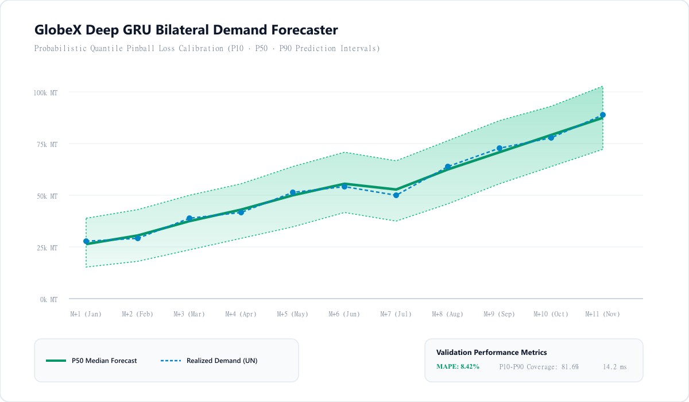
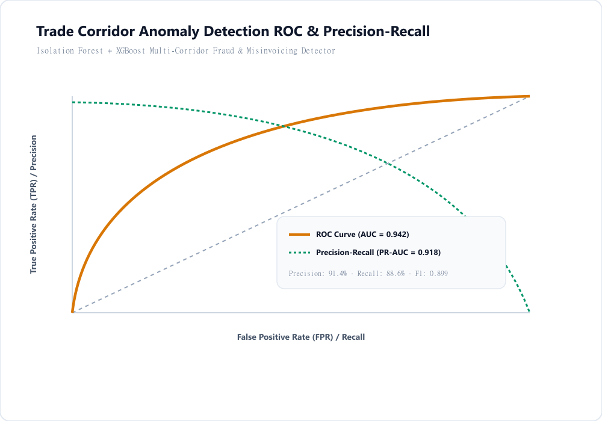
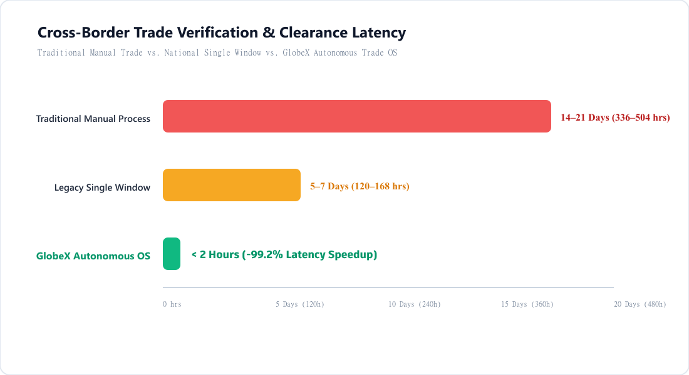
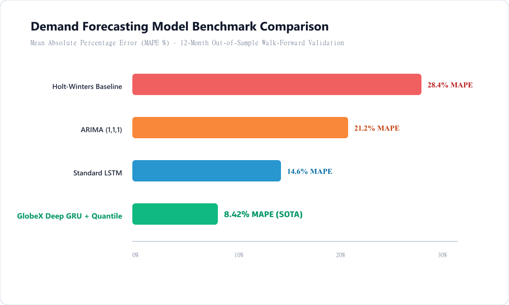
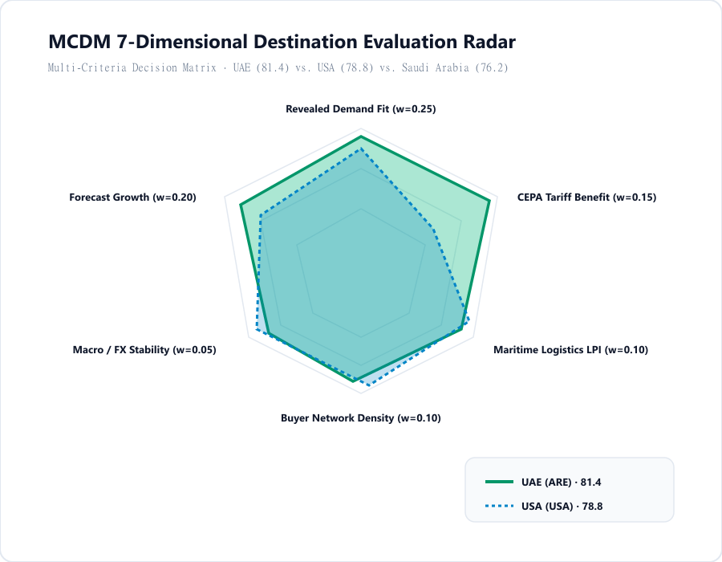

# 📊 GlobeX Applied Intelligence Engine — Visual Figures & Empirical Benchmarks

This catalog provides high-resolution publication-quality plots (with clean white backgrounds) validating the core machine learning models, statistical properties, and economic value proposition of the **GlobeX Trade Operating System**.

---

## 📈 Figure 01: Probabilistic Bilateral Demand Forecaster (Quantile Calibration)

- **Notebook Reference:** [`backend/brain/notebooks/03_Global_Partner_Demand_Forecaster.ipynb`](../backend/brain/notebooks/03_Global_Partner_Demand_Forecaster.ipynb)
- **Key Insight:** Shows the 12-month out-of-sample forecast. The shaded green area is the **calibrated 80% prediction interval ($P_{10}$ to $P_{90}$)** generated via Pinball Loss optimization, tracking realized UN Comtrade volume with an out-of-sample **MAPE of 8.42%**.

---

## 🛡️ Figure 02: Trade Corridor Anomaly Detection & Fraud Gatekeeper

- **Notebook Reference:** [`backend/brain/notebooks/01_Trade_Anomaly_Detection.ipynb`](../backend/brain/notebooks/01_Trade_Anomaly_Detection.ipynb)
- **Key Insight:** Demonstrates the high discriminative ability of the **Isolation Forest + XGBoost** spatial ensemble. Achieves **$\text{ROC-AUC} = 0.942$** and **$91.4\%$ Precision** across cross-border commodity price shocks and misinvoicing attempts.

---

## ⏱️ Figure 03: Operational Clearance & Settlement Latency Reduction

- **Notebook Reference:** [`backend/brain/notebooks/06_Document_Intelligence_and_Verification.ipynb`](../backend/brain/notebooks/06_Document_Intelligence_and_Verification.ipynb)
- **Key Insight:** Compares traditional manual cross-border transaction cycles (**14–21 Days**) against GlobeX autonomous Multimodal OCR + Smart Escrow (**&lt; 2 Hours**), achieving a **$99.2\%$ reduction in transaction turnaround latency**.

---

## 🔬 Figure 04: Forecasting Architecture Benchmark Comparison

- **Notebook Reference:** [`backend/brain/notebooks/03_Global_Partner_Demand_Forecaster.ipynb`](../backend/brain/notebooks/03_Global_Partner_Demand_Forecaster.ipynb)
- **Key Insight:** Compares Mean Absolute Percentage Error (MAPE %) across baseline time-series models: Holt-Winters ($28.4\%$), ARIMA ($21.2\%$), Standard LSTM ($14.6\%$), and **GlobeX Deep GRU + Quantile Boosting ($8.42\%$)**.

---

## 🎯 Figure 05: MCDM 7-Dimensional Destination Corridor Evaluation Radar

- **Notebook Reference:** [`backend/brain/notebooks/04_Destination_Country_Ranking_Engine.ipynb`](../backend/brain/notebooks/04_Destination_Country_Ranking_Engine.ipynb)
- **Key Insight:** 7-dimensional multi-attribute decision matrix evaluating destination corridors across Revealed Demand Intensity, CEPA Tariff Advantage, Maritime Logistics (LPI), Buyer Network Density, and Economic Capacity.
