# GlobeXAI Trade OS — Complete n8n & PostgreSQL Workflow Guide

This document provides a detailed breakdown of the complete **n8n Master Trade Automation Workflow** (`n8n/globex_complete_postgres_master_workflow.json`) and its integration with the **PostgreSQL Database** (`n8n/supabase_schema_setup.sql`) and **FastAPI ML Microservices**.

---

## 1. Overview of the 5 Master Sub-Pipelines

The n8n workflow orchestrates 5 cross-border trade sub-pipelines:

```mermaid
graph TD
    subgraph Pipeline 1: AI Trade Analysis
        W1[Webhook: /webhook/analyze-trade] --> N1[Normalize Payload]
        N1 --> HS1[FastAPI: HS Code]
        HS1 --> GRU1[FastAPI: Dual-GRU Market Opp]
        GRU1 --> ANOM1[FastAPI: XGBoost Anomaly]
        ANOM1 --> CPM1[FastAPI: Counterparty Match]
        CPM1 --> CPR1[FastAPI: Isolation Forest Risk]
        CPR1 --> CEP1[FastAPI: CEPA Tariff RAG]
        CEP1 --> SYN1[Code: Synthesize Verdict]
        SYN1 --> PG1[(Postgres: public.trade_analysis)]
        SYN1 --> R1[Respond JSON]
    end

    subgraph Pipeline 2: Document Verification
        W2[Webhook: /webhook/document-uploaded] --> OCR2[FastAPI: OCR Extract]
        OCR2 --> CEP2[FastAPI: Compliance Check]
        CEP2 --> SYN2[Code: Synthesize Doc Hash]
        SYN2 --> PG2[(Postgres: trade_documents & blockchain_records)]
        SYN2 --> R2[Respond JSON]
    end

    subgraph Pipeline 3: Marketplace Buyer Matching
        W3[Webhook: /webhook/marketplace-match] --> MBM3[FastAPI: Match Buyers]
        MBM3 --> PG3[(Postgres: Query public.organizations)]
        PG3 --> SYN3[Code: Synthesize Buyers]
        SYN3 --> R3[Respond JSON]
    end

    subgraph Pipeline 4: Trade Lifecycle & Escrow
        W4[Webhook: /webhook/create-trade] --> ESC4[Code: Generate Multi-Sig Vault]
        ESC4 --> PG4[(Postgres: public.trades & escrow_accounts)]
        ESC4 --> R4[Respond JSON]
    end

    subgraph Pipeline 5: Maritime AIS Tracking
        W5[Webhook: /webhook/track-shipment] --> TEL5[Code: Ingest GPS/AIS Data]
        TEL5 --> PG5[(Postgres: public.shipments)]
        TEL5 --> R5[Respond JSON]
    end
```



---

## 2. Sub-Pipeline 1: AI Trade Intelligence & Anomaly Engine

### Webhook Endpoints
- **Production**: `POST http://localhost:5678/webhook/analyze-trade`
- **Test Mode**: `POST http://localhost:5678/webhook/test-trade-analysis`

### Nodes Executed in Sequence
1. **Set — Normalize Trade Intake**: Validates and normalizes product name, origin/destination ISO3 codes, quantity (kg), target price, and certifications.
2. **HTTP — HS Classifier**: Calls `POST /predict/hs-code` on FastAPI to resolve canonical HS6 (e.g., `1006.30`).
3. **HTTP — GRU Market Opportunity**: Calls `POST /predict/market-opportunity` using the Dual-Head GRU forecaster to compute market absorption and price forecasts across destination corridors.
4. **HTTP — XGBoost Trade Anomaly**: Calls `POST /api/trade-anomaly/predict` to detect volume collapses or price spikes against 3-month rolling baselines.
5. **HTTP — Counterparty Matcher**: Calls `POST /predict/counterparty-match` to rank verified suppliers.
6. **HTTP — Trade Risk Model**: Calls `POST /predict/counterparty-risk` to run the Isolation Forest risk model.
7. **HTTP — CEPA Compliance RAG**: Calls `POST /compliance/rag-analyze` to retrieve preferential bilateral tariffs and mandatory export documents.
8. **Code — Synthesize All Models**: Calculates a composite trade readiness score (0–100) and formats a structured entity.
9. **Postgres — Save Trade Analysis**: Inserts the analysis into `public.trade_analysis`:
   ```sql
   INSERT INTO public.trade_analysis (
     analysis_id, product_name, hs6_code, origin_country, destination_country,
     quantity_kg, forecast_demand_mt, expected_fob_price, opportunity_score,
     risk_level, anomaly_flag, raw_payload
   ) VALUES (...)
   ```
10. **Respond — Trade Analysis JSON**: Returns full aggregated analysis to the frontend.

---

## 3. Sub-Pipeline 2: Document Verification & Blockchain Anchor

### Webhook Endpoint
- `POST http://localhost:5678/webhook/document-uploaded`

### Nodes Executed in Sequence
1. **HTTP — Document OCR Extract**: Calls `POST /documents/ocr-extract` to extract metadata from bills of lading or commercial invoices.
2. **HTTP — Doc Compliance Check**: Validates document fields against CEPA trade rules.
3. **Code — Synthesize Doc Verdict**: Computes a SHA-256 hash of the document and generates a simulated Polygon transaction hash (`0x...`).
4. **Postgres — Save Doc & Blockchain Anchor**:
   - Inserts document metadata into `public.trade_documents`.
   - Anchors the cryptographic hash in `public.blockchain_records` with `chain_id = 137` (Polygon).
5. **Respond — Doc Verification JSON**: Returns `status: VERIFIED`, document hash, and compliance status.

---

## 4. Sub-Pipeline 3: Marketplace Demand Matching

### Webhook Endpoint
- `POST http://localhost:5678/webhook/marketplace-match`

### Nodes Executed in Sequence
1. **HTTP — Demand Buyer Match**: Calls `POST /api/v1/marketplace/match-buyers` on FastAPI.
2. **Postgres — Fetch Verified Buyers**: Queries `public.organizations`:
   ```sql
   SELECT id, name, country_code, business_type, trust_score 
   FROM public.organizations 
   WHERE business_type = 'IMPORTER' 
   ORDER BY trust_score DESC 
   LIMIT 5;
   ```
3. **Code — Synthesize Buyers**: Combines ML recommendation signals with live database buyer profiles.
4. **Respond — Buyer Matches JSON**: Returns ranked institutional buyer candidates.

---

## 5. Sub-Pipeline 4: Trade Lifecycle & Escrow Vault Creation

### Webhook Endpoint
- `POST http://localhost:5678/webhook/create-trade`

### Nodes Executed in Sequence
1. **Code — Initiate Escrow Vault**: Generates a deterministic Trade ID (`TRD-IND-ARE-550K`) and a multi-sig smart contract vault address (`0x...`).
2. **Postgres — Save Trade & Escrow**:
   - Inserts contract parameters into `public.trades` (`status = 'ESCROW_LOCKED'`).
   - Inserts vault details into `public.escrow_accounts` (`token_symbol = 'USDC'`).
3. **Respond — Trade & Escrow JSON**: Returns vault address, collateral requirements, and release milestones.

---

## 6. Sub-Pipeline 5: Maritime AIS Tracking & Geofencing

### Webhook Endpoint
- `POST http://localhost:5678/webhook/track-shipment`

### Nodes Executed in Sequence
1. **Code — Format Telemetry**: Ingests vessel coordinates (`current_lat`, `current_lng`), port LOCODEs (`INNSA` -> `AEJEA`), and ETA calculations.
2. **Postgres — Upsert Shipment GPS**: Upserts container tracking in `public.shipments`:
   ```sql
   INSERT INTO public.shipments (
     shipment_id, trade_id, vessel_name, origin_port, destination_port,
     current_lat, current_lng, status
   ) VALUES (...) 
   ON CONFLICT (shipment_id) DO UPDATE SET
     current_lat = EXCLUDED.current_lat,
     current_lng = EXCLUDED.current_lng,
     status = EXCLUDED.status,
     updated_at = NOW();
   ```
3. **Respond — Shipment Telemetry JSON**: Returns live container tracking telemetry.

---

## 7. Database Table Schema Reference (`n8n/supabase_schema_setup.sql`)

| Table Name | Primary Key | Key Foreign Keys | Purpose |
|---|---|---|---|
| `organizations` | `id (UUID)` | None | Stores exporter and buyer profiles with verification & trust scores. |
| `trust_scores` | `id (UUID)` | `organization_id -> organizations(id)` | Detailed trust breakdown (completed trades, dispute count, volume). |
| `trade_analysis` | `id (UUID)` | None (`analysis_id` unique) | Logs ML opportunity scores, demand forecasts, and anomaly flags. |
| `trades` | `id (UUID)` | `exporter_id, importer_id -> organizations(id)` | Canonical trade contract records and lifecycle statuses. |
| `escrow_accounts` | `id (UUID)` | `trade_id -> trades(trade_id)` | Smart contract vault addresses and locked USDC collateral. |
| `blockchain_records` | `id (UUID)` | `trade_id -> trades(trade_id)` | Document SHA-256 hashes anchored on-chain with tx hashes. |
| `trade_documents` | `id (UUID)` | `trade_id -> trades(trade_id)` | Invoices, bills of lading, and phytosanitary certificates. |
| `shipments` | `id (UUID)` | `trade_id -> trades(trade_id)` | Real-time maritime AIS vessel coordinates and voyage status. |

---

## 8. How to Import and Connect

1. **Execute SQL Migration**:
   Run `n8n/supabase_schema_setup.sql` in your PostgreSQL or Supabase SQL Editor.
2. **Import Workflow**:
   In n8n, import `n8n/globex_complete_postgres_master_workflow.json`.
3. **Set Postgres Credential**:
   Create a Postgres credential named `GlobeX PostgreSQL / Supabase` in n8n and point it to your database host.
4. **Activate**:
   Toggle the workflow to **Active**. The frontend and cURL scripts will immediately process real-time ML inference and PostgreSQL database persistence.
