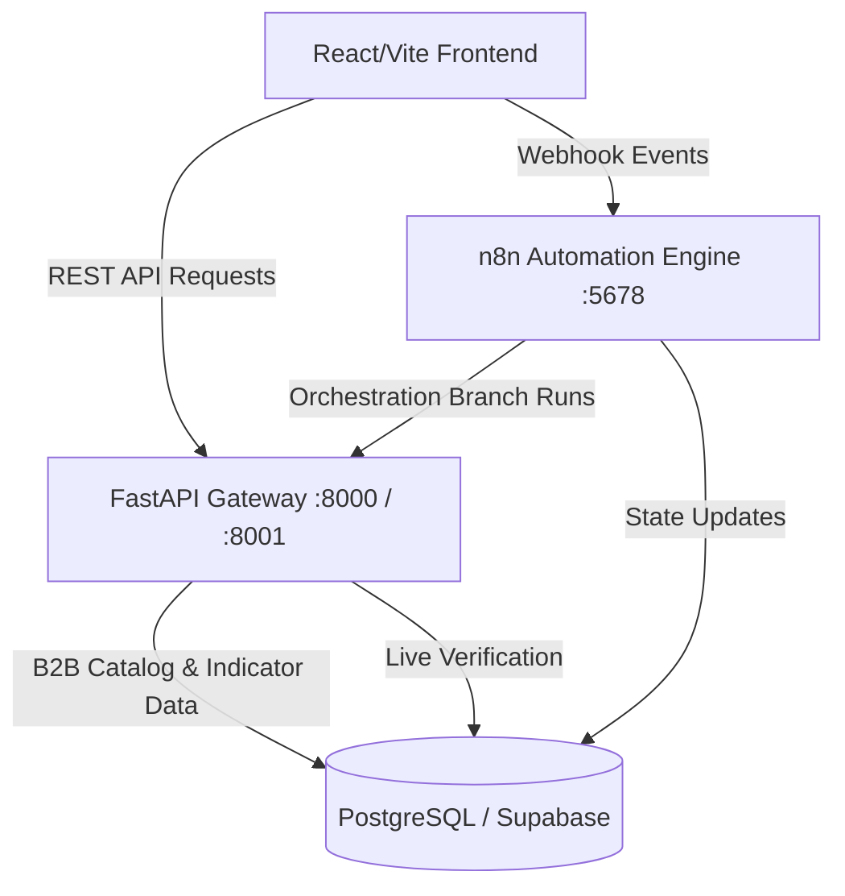

# GlobeXAI Trade OS — System Workflow Guide

Welcome to the **GlobeXAI Trade OS** workflow guide. This document explains how the different layers of GlobeXAI (Frontend, Backend APIs, n8n Automation, and Database) work together to automate cross-border B2B trade.

---

## 1. High-Level Architecture Overview

GlobeXAI is structured as a three-tier system designed to automate cross-border trade intelligence, counterparty discovery, compliance checking, and transaction orchestration.

1. **React/Vite Frontend (`src/`)**: An interactive dashboard, marketplace, trade intake wizard, and transaction workspace.
2. **FastAPI Backend Gateway (`main.py`, `src/api/`)**: A unified API hosting the ML model inference engines, product catalogues, and rules systems.
3. **n8n Automation Engine (`n8n/`)**: A workflow orchestrator that processes active trades (creating escrow, checking documents via OCR, logging customs shipments, and ingesting trade histories).
4. **PostgreSQL/Supabase Database**: The relational persistence layer storing organizations, trades, escrow logs, compliance scores, and shipment logs.

---

## 2. The Core B2B Trade User Journey

GlobeXAI guides exporters and importers through a step-by-step pipeline from initial product classification to final escrow settlement:

```mermaid
graph LR
    Onboard[1. Onboarding & KYB] --> HS[2. HS6 Resolution]
    HS --> Discovery[3. Market Discovery]
    Discovery --> Match[4. Counterparty Match]
    Match --> Compliance[5. Compliance RAG]
    Compliance --> Contract[6. Digital Contract]
    Contract --> Escrow[7. Web3 Escrow]
    Escrow --> Shipment[8. Shipment & Customs]
```

### Step 1: Onboarding & Trust Profiling
- Exporters and importers register via the **Onboarding Page** (`OnboardingPage.tsx`).
- The organization is registered in the database, and initial credentials and certifications are verified. A **Trust Score** is assigned based on historical records.

### Step 2: Trade Intent & HS6 Code Resolution
- The exporter inputs a cargo description (e.g., *"Premium Basmati Rice"*).
- The frontend requests `/predict/hs-code` on the backend, which matches the description against the product catalogue and returns a canonical 6-digit Harmonized System (HS) code (e.g., `1006.30` for Basmati Rice).

### Step 3: Market Discovery & Demand Forecasting
- Exporters search for viable export destinations.
- The backend `/predict/market-opportunity` runs a deep-learning forecasting model (GRU) over 26 years of global trade panel data to forecast demand and prices for that HS6.
- The **Opportunity Ranking Engine** scores countries on tariffs, Revealed Comparative Advantage (RCA), GDP, population, and logistics (e.g., port counts).

### Step 4: Counterparty Matching & Risk Intelligence
- Once a target country is selected, the exporter requests matching buyers.
- `/predict/counterparty-match` queries the database for buyers accepting that commodity in the target country, ranking them by a matching score.
- `/predict/counterparty-risk` runs an **Isolation Forest** anomaly model to screen for transaction history alerts, trade disputes, and compliance flags.

### Step 5: Regulatory Compliance & RAG Analysis
- The exporter triggers a regulatory check.
- `/compliance/rag-analyze` evaluates international treaties (e.g., India-UAE CEPA) to compute preferential tariff rates (e.g., 0% instead of the standard 5% MFN rate) and lists mandatory import/export documents.

### Step 6: Trade Intention & Escrow Collateralization
- Exporter and Importer align on trade terms (Incoterms, price, volume) via the **Trade Intent Wizard** (`TradeIntentWizardPage.tsx`).
- A digital contract is drafted, and the importer collateralizes the trade by locking USDC/USDT stablecoins in the Web3 Escrow Vault.

### Step 7: Document Verification & Shipping
- Documents (Commercial Invoice, Bill of Lading, Certificate of Origin) are uploaded to the **Trade Workspace** (`TradeWorkspacePage.tsx`).
- FastAPI parses documents using OCR. n8n triggers the verification pipeline to match document values against contract terms (verifying that weights, prices, and HS codes match).
- Once customs clearance alerts fire, the shipment is logged, and escrow funds are automatically disbursed to the exporter.

---

## 3. Database Schema & Tables

The system maintains 18 core tables (managed via Supabase). The primary tables for trade execution and logging are:

| Table Name | Description |
|---|---|
| `organizations` | Profiles of exporters, importers, and trade entities with trust scores. |
| `trades` | Canonical record of active trade contracts, prices, volumes, and statuses. |
| `trade_analysis` | Stores pre-computed compliance audits, anomaly flags, and RAG outputs. |
| `escrow_accounts` | Tracks collateral lockups, release conditions, and blockchain transaction hashes. |
| `shipment_events` | Logs container shipping coordinates, carrier info, and customs clearances. |

---

## 4. Integration with n8n Automation Workflows

Active trade actions are orchestrated by **n8n**. When a user takes action in the frontend, the app sends a webhook request to n8n to execute multi-step scripts:

- **Analysis Branch**: Triggered when a trade is submitted; updates `trade_analysis` in the DB.
- **Contract/Escrow Branch**: Automatically registers the contract in the ledger.
- **OCR Verification Branch**: Initiates OCR document extraction, validates values, and flags compliance discrepancies.
- **Shipment Branch**: Listens for customs updates and auto-releases escrow funds when carrier verification is received.
